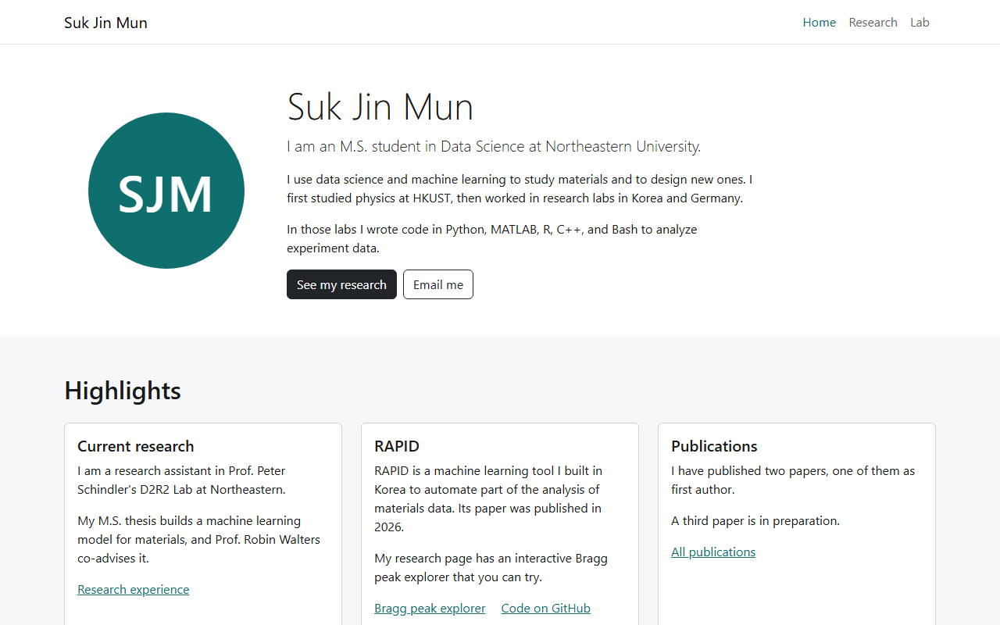

# Suk Jin Mun, personal homepage

A three page static homepage built with HTML5, CSS3, ES6 modules, and Bootstrap 5.3.

## Links

\# Live site: added when the repository is deployed with GitHub Pages\
\# Design document: [docs/design_document.pdf](docs/design_document.pdf)\
\# Video: added after recording\
\# Slides: added after upload

## Author

Suk Jin Mun, [mun.s@northeastern.edu](mailto:mun.s@northeastern.edu), GitHub [SukjinMun](https://github.com/SukjinMun)

## Class link

[CS5610 Web Development, Northeastern University](https://johnguerra.co/classes/webDevelopment_online_fall_2026/)

## Project objective

I am an M.S. Data Science student at Northeastern University, and I use data science and machine learning for materials research. The site shows who I am, my research and publications, and how to reach me.

## Screenshot



## Pages

\# index.html, Home: a short intro, highlights, education, and contact links.\
\# research.html, Research: my interests, research positions, publications, and the Bragg peak explorer.\
\# lab.html, Lab: an interactive 2D Ising model, made with GenAI as described below.

All pages share the navbar, the footer, and css/style.css. js/main.js marks the current page and sets the footer year.

## Original component

The Bragg peak explorer on research.html is written from scratch in js/bragg.js. You pick a crystal type, a size, and a light source, and it draws where the peaks fall on a canvas and lists them in a table.

## Instructions to build

The site is static and has no build step.

1. Clone the repository and open its folder.

   ```bash
   git clone https://github.com/SukjinMun/CS5610_project1_SJM.git
   cd CS5610_project1_SJM
   ```

2. `npm install` installs Bootstrap 5.3.8 and the dev tools (ESLint, Prettier, http-server).
3. `npm start` serves the site at http://localhost:8080.
4. `npm run lint` runs ESLint with the class config.
5. `npm run format` formats the files with Prettier.

Any static server works, for example `python3 -m http.server 8080`. Use a server, since ES modules do not load from file:// URLs.

## Project structure

```text
CS5610_project1_SJM/
├── index.html          Home
├── research.html       Research and the Bragg peak explorer
├── lab.html            Lab and the 2D Ising model
├── css/style.css       Styles on top of Bootstrap
├── js/main.js          Active navbar link and footer year
├── js/bragg.js         Bragg peak explorer
├── js/ising.js         Ising model
├── images/             Avatar, favicon, screenshot, thumbnail
├── docs/               Design document PDF
├── eslint.config.js    Class ESLint config
├── package.json        Scripts and dependencies
└── LICENSE             MIT License
```

## GenAI use

Model: Claude Opus 5.5 (claude-opus-5-5) by Anthropic, through Claude Code, September 2026.

AI made the Lab page (lab.html, js/ising.js, and the Lab part of css/style.css) after I finished my other two pages. I gave it my pages as the style reference and agreed on a plan before any code. My prompts, shortened:

1. You are a full stack developer with 20 years of experience. Plan first, change no files, and ask me questions.
2. Plan a 2D Ising model page with a temperature slider, play, reset, and grid size, with no libraries.
3. Write lab.html with my shared header and footer.
4. Write the simulation in js/ising.js.
5. Connect the controls and the readouts.
6. Test it in Chrome and fix what is broken.
7. Add a Tc mark and a small magnetization plot.
8. Match my other pages and make it work on a phone.
9. Add canvas labels and keyboard focus.
10. Fix the ESLint and W3C errors.

The same assistant also helped build and review my other two pages, the design document, and this README, and it later shortened the Lab page text.

## License

Released under the [MIT License](LICENSE).
